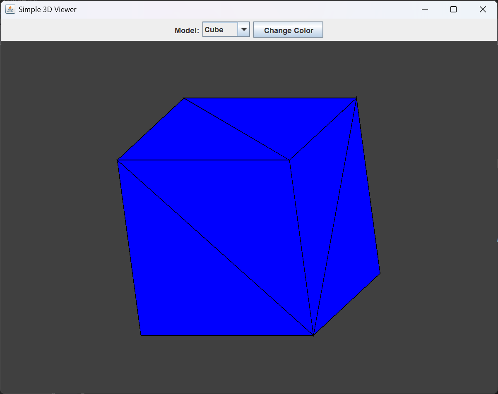
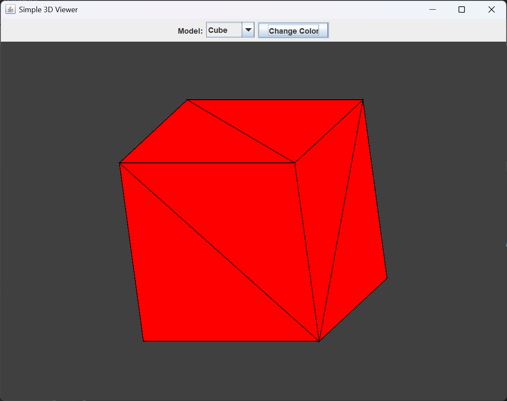
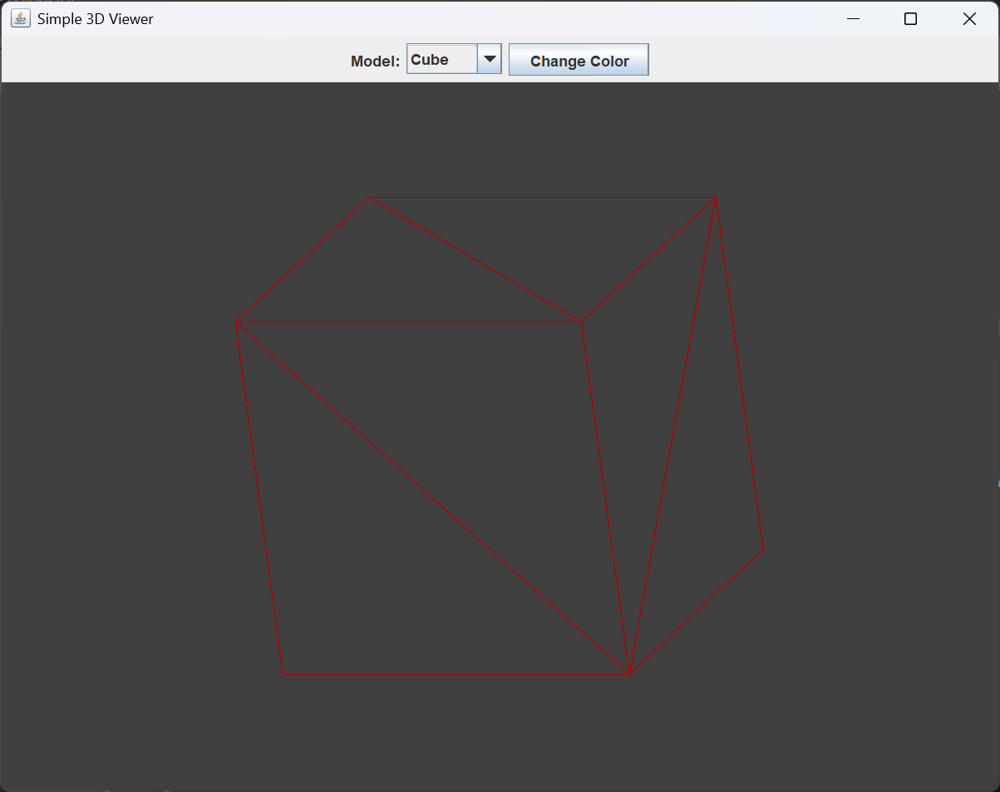
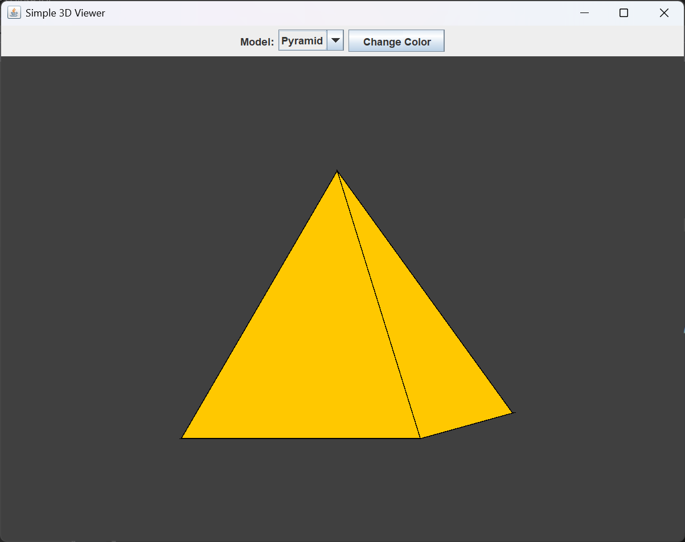
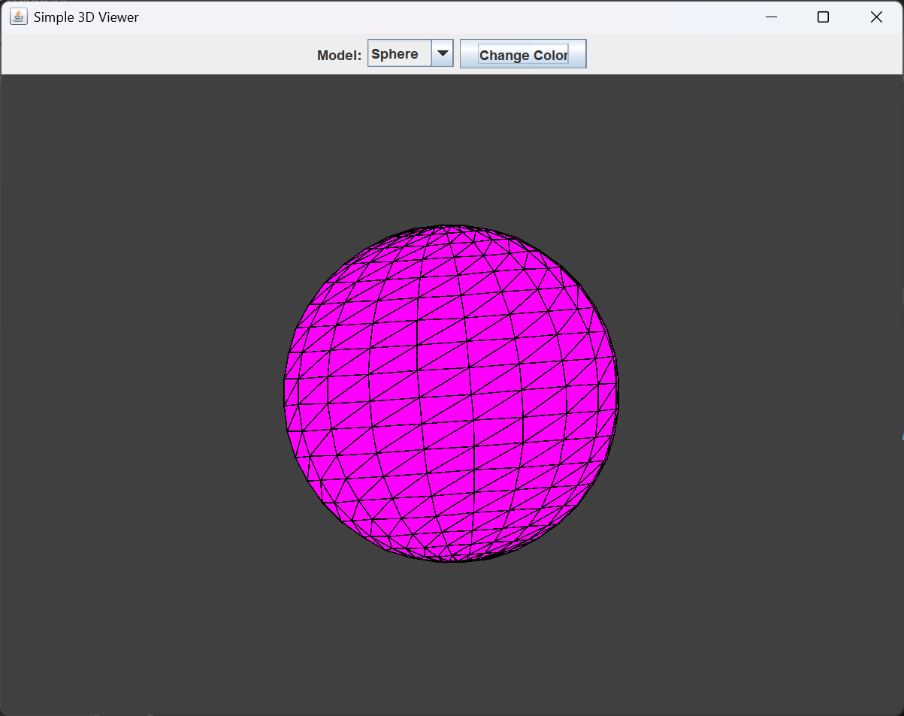

# 3D-Viewer

A simple Java Swing application to visualize 3D models including Cube, Pyramid, and Sphere with rotation, zoom, wireframe mode, and color customization.

---

## Features

- Interactive 3D rotation with mouse drag
- Zoom in/out with mouse wheel
- Switch between models: Cube, Pyramid, Sphere
- Change model colors with a button
- Toggle wireframe and solid rendering modes (press **W**)
- Reset view with **R** key

---

## Screenshots

### Cube (Blue)

### Cube (Red)

### Cube Wireframe

### Pyramid

### Sphere

---

## How to Run

1. Clone this repository:
git clone https://github.com/suganworks/3D-Viewer.git
2. Open the project in your favorite Java IDE (e.g., Eclipse, IntelliJ IDEA).
3. Run the `View3D.java` file.
4. Use mouse and keyboard controls as described above.

---

## Controls

- **Mouse drag**: Rotate model  
- **Mouse wheel**: Zoom in/out  
- **Model selector (top dropdown)**: Choose Cube, Pyramid, or Sphere  
- **Change Color button**: Cycle through preset colors  
- **W key**: Toggle wireframe mode  
- **R key**: Reset rotation and zoom

---

## Technologies Used

- Java
- Swing (Java GUI toolkit)
- Basic 3D math and rendering

---

## Author

[Sugathan Sugan](https://github.com/suganworks)

---

## License

This project is licensed under the MIT License. See the [LICENSE](LICENSE) file for details.
